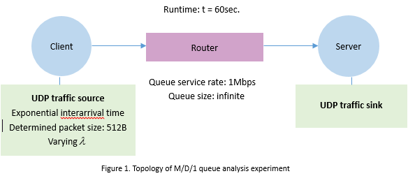

# README #

This README would navigate the reproducible M/D/1 queue analyzing experiment

### M/D/1 queue analysis background　###

* Under the condition that packets in network topology have a exponentially distributed arriving rate and determined service rate. This experiment is designed to analyze the average queue length waiting for service given different utilization rate. We compared our implementation over GENI testbed result and ns2 simulator simulation result with analytical result. We also compared average M/D/1 queue length with average M/M/1 queue length.
So we keep monitoring the average queue length for both GENI testbed and ns2 simulation for M/D/1 queue. We use the data acquired previously. 
* V2.0
* [ＭＤ１ experiment](https://bitbucket.org/bubbledoodle/el7353-sl5352)

### Instructions ###
In this experiment you need to set up the simple topology like below.


#### GENI testbed ####
* In this experiment, you need to setup the topology and install D-IGT first on your client and server node in the topology. Then you are going to generate UDP traffic on client node, monitor queue length at router and arriving rate at server node.

* To setup the topology, you need to create a new slice on the GENI portal. Then on your topology, the client and server node, install D-ITG using 
```
sudo apt-get update 
sudo apt-get install d-itg
```
* To run the experiment, run the following command on the server nodes
```
ITGRecv
```
Leave that running, on the client node, run:
```
ITGSend -a server -l sender.log -x receiver.log -E 225 -c 512 -t 60000 -T UDP
```
To monitor average arriving rate, on the server node run command:
```
ITGDec receiver.log
```
To get the average queue length, you should using Linux Traffic Control(tc) utility to manipulate queue setting and monitor queue. Run the following command on the router, where the [queuemonitor.sh](https://bitbucket.org/bubbledoodle/el7353-sl5352/raw/95be027bc4f6a6238fda12b6df0e44832c4e02cf/queuemonitor.sh):
```
sudo tc qdisc replace dev eth2 root tbf rate 1mbit limit 200mb burst 32kB peakrate 1.01mbit mtu 1600
./queuemonitor.sh eth2 40 0.1 | tee router.txt
cat router.txt | sed 's/\p / /g' | awk  '{ sum += $37 } END { if (NR > 0) print sum / NR }'
```
Note this is one time experiment. In this experiment we are going to vary the mean packets arriving rate from 225 to 125 by step 25. Each arriving rate get five replications.

#### NS2 ####
* In this experiment, you should previous install ns2 simulator using command below:
```
sudo apt-get install ns2
```
By using the tcl script [md1.tcl](https://bitbucket.org/bubbledoodle/el7353-sl5352/raw/95be027bc4f6a6238fda12b6df0e44832c4e02cf/MD1.tcl) with command:
```
ns md1.tcl 1
``` 
This will leave us two trace file, acquire necessary data using following command:
```
cat qm.out  | awk '{sum1 += $5 } END { if (NR>0) print sum1 / NR}   {sum2 += $6} END {if (NR>0) print sum2/NR} {sum3 += $9} END {if (NR >0) print sum3/NR} {sum4 += $7} END {if (NR >0) print sum4/NR} {sum5 += $10} END {if (NR>0) print sum5/NR}' 
```
this will yield average queue size(packets), Arrivals(packets), Departure(packets), Departures(bytes), arrival(bytes)

### result ###
The raw data is in two mat_file, to analyze the data, use [MD1_analyze](https://bitbucket.org/bubbledoodle/el7353-sl5352/raw/6050d261191fa7b463a69fd248a7007f638b1ba1/MD1_analyze.m)

* M/D/1 queue analysis


* M/M/1 vs M/D/1


The analysis is on the [report](Lab3_4_5.pdf)
